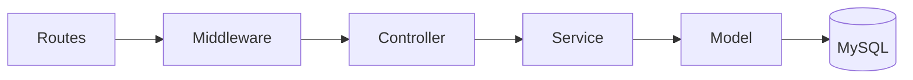
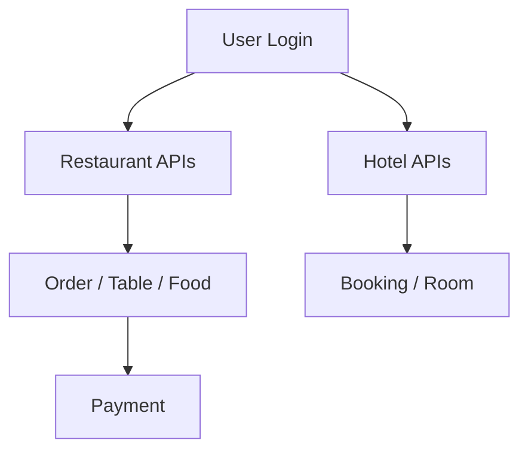

# RHMS

Restaurant & Hotel Management System (RHMS) là hệ thống quản lý tích hợp cho nhà hàng và khách sạn, gồm xác thực người dùng, quản lý bàn ăn, menu, đơn hàng, thanh toán và nền tảng dữ liệu khách sạn.

## Mô Hình Dự Án

Backend được tổ chức theo luồng chuẩn:



Luồng nghiệp vụ chính:



## Cấu Trúc Thư Mục

```text
RHMS/
├─ backend/
│  ├─ config/            # Cấu hình DB
│  ├─ controllers/       # Controller API
│  ├─ middlewares/      # Auth, role, upload, error handler
│  ├─ migrations/        # Migration MySQL
│  ├─ models/            # Sequelize models
│  ├─ modules/           # Module đặc thù (restaurant, payment)
│  ├─ routes/            # REST routes chính
│  ├─ scripts/           # migrate / seed helper
│  ├─ services/          # Business logic
│  ├─ src/seeds/seed.js  # Seed data mẫu
│  └─ tests/             # Jest + Supertest
├─ frontend/             # React + Vite UI
└─ README.md
```

## Cài Đặt

### 1) Backend dependencies

```bash
cd backend
npm install
```

### 2) Tạo file `.env`

Tạo `backend/.env` với nội dung tối thiểu:

```env
PORT=5000
DB_HOST=localhost
DB_PORT=3306
DB_NAME=webrhms
DB_USER=root
DB_PASSWORD=
JWT_SECRET=webrhms_secret_key
JWT_EXPIRES_IN=24h
```

## Lệnh Chạy Backend

```bash
cd backend
npm run dev
```

## Lệnh Migrate

```bash
cd backend
npm run migrate
```

## Lệnh Seed Data

Script seed nằm tại `backend/src/seeds/seed.js` và có kiểm tra dữ liệu hiện có trước khi chèn.

```bash
cd backend
npm run seed
```

Seed mẫu sẽ tạo:

* 1 SuperAdmin
* 1 HotelManager
* 1 RestaurantManager
* 2 Staff
* 1 Customer
* 5 món ăn
* 5 bàn ăn
* 5 phòng khách sạn

## Lệnh Test

```bash
cd backend
npm test
```

Jest được cấu hình cho dự án ESM và Supertest được dùng cho integration test của API.

## Ghi Chú Kiến Trúc

* API response chuẩn hóa theo dạng `success`, `message`, `data`.
* Error response dùng dạng `success: false`, `message`, `errors: null`.
* JWT dùng chung cho cả hai phân hệ Nhà hàng và Khách sạn.
* Order có thể nhận thêm `hotelBookingId` và `roomNumber` để hỗ trợ đặt món về phòng.

## Công Nghệ Sử Dụng

* Backend: Node.js, Express, Sequelize
* Database: MySQL
* Test: Jest, Supertest
* Frontend: React, Vite, Tailwind CSS

## Thành Viên Nhóm

| Tên | MSSV | Vai trò |
| --- | --- | --- |
| Phan Thị Ngân Quỳnh | 24100457 | Nhóm trưởng |
| Nghiêm Thị Mai Diễm | 24107772 | Thành viên |
| Đặng Ngọc Khuê | 24100493 | Thành viên |

## Git Workflow

* `main`: phiên bản ổn định
* `dev`: nhánh phát triển chính
* `feature/*`: nhánh tính năng

Ví dụ:

```text
feature/restaurant-auth-quynh
feature/hotel-booking-diem
feature/payment-khue
```